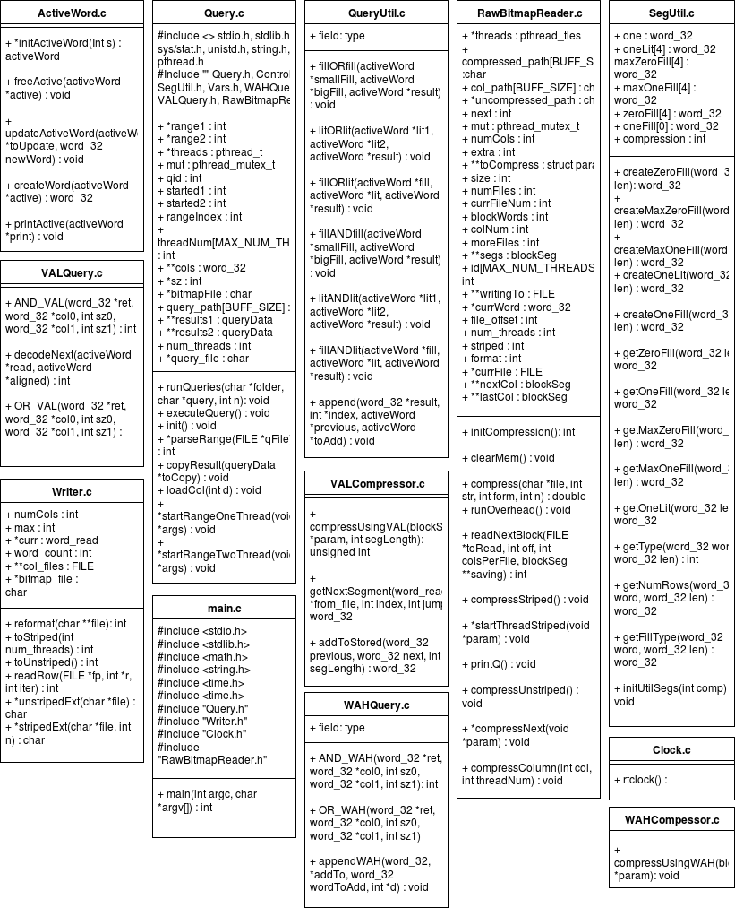

## Execution instructions
  First Navigate to the BitmapEngine/src/ directory...
  ... there you'll find a Makefile, so issue :

    $ make

  ^ the above command will generate a number of object files as well as an executable called 'main'.

  In order to remove the object files and the executable, issue :

    $ make clean

